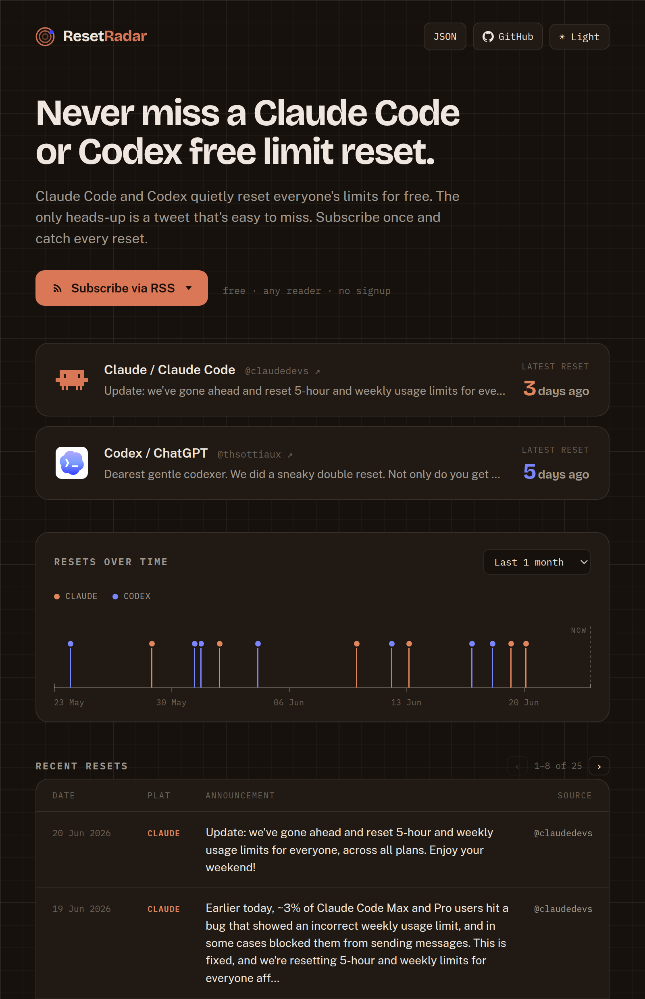

<h1 align="center">ResetRadar</h1>

<p align="center">
  
</p>

<p align="center">
  
  
  
  
</p>

<p align="center"><em>Know the moment Claude Code or Codex resets everyone's usage limits. Dashboard, JSON, and RSS, no signup.</em></p>

## Why

Claude Code and Codex occasionally reset everyone's usage limits for free, usually after a bug or incident. The announcement only lands on X, so it's easy to miss, and a reset that arrives just before your own weekly rollover is a whole quota left unused. ResetRadar watches the official accounts and records every reset.

It tracks *global* resets (the ones that apply to everyone), not your personal reset clock.

## How it works

A poller runs on a GitHub Actions cron (hourly), reads the official accounts, and appends to an event ledger that drives every output.

```
sources -> detector -> events.json -> latest.json · feed.xml · dashboard
```

Only official X accounts mint events (`@ClaudeDevs`, `@AnthropicAI`, `@OpenAIDevs`, `@thsottiaux`, `@sama`, and a few more), read for free via [Nitter](https://github.com/zedeus/nitter) RSS, with [fxtwitter](https://github.com/FixTweet/FxTwitter) filling in dated history. Every event is an official announcement.

## Subscribe

- **Telegram**: join [t.me/ResetRadar](https://t.me/ResetRadar) for a push the moment a reset lands.
- **RSS**: point any reader at a feed (or pipe it into anything):
  - `.../ResetRadar/feed.xml` for Claude Code and Codex
  - `.../ResetRadar/feed-claude.xml` for Claude Code only
  - `.../ResetRadar/feed-codex.xml` for Codex only
- **Dashboard**: `https://giuliocapecchi.github.io/ResetRadar/` (the Subscribe button picks a channel).
- **JSON**: `latest.json`, next to the feeds, if you'd rather poll it.

## Run

```bash
uv sync                           # install
uv run resetradar serve           # serve the cached dashboard at http://localhost:8000
uv run resetradar serve --poll    # refresh the cache from live sources, then serve
uv run resetradar poll            # update the ledger from live sources (no server)
uv run pytest                     # tests
```

`serve` uses the cached ledger and hits the network only on the first run, so repeated runs are instant and offline. Outputs land in `data/`: `events.json` (ledger), `latest.json` (JSON), `feed.xml` (RSS).

## License

MIT, see [`LICENSE`](LICENSE).

---

<sub>Not affiliated with Anthropic or OpenAI.</sub>
